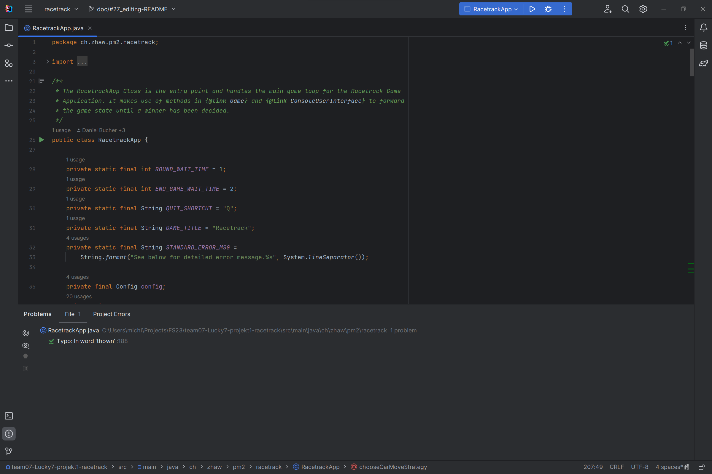
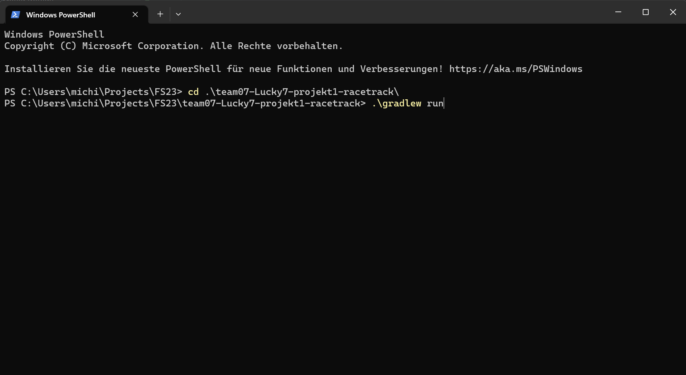

 

    

<h3 align="center">Racetrack</h3>

  

    Welcome to the TeamLucky7 Race, where the only thing faster than our code is the speed at which your car will crash into a wall.
     
     
    <a href="#getting-started">Getting Started</a>
    ·
    <a href="#program-flow">Program Flow</a>
    ·
    <a href="#features">Features</a>
    ·
    <a href="#class-diagram">Class Diagram</a>
    ·
    <a href="#github-workflow">GitHub Workflow</a>
  

## Getting Started

### Start the program

There are two ways of starting the program:

#### Starting with IntelliJ:

1. Open the repository in the IntelliJ IDE and navigate to the `App.java` file.
2. Click  `Run` next to the `Current File` option
   on the
   toolbar.

#### Starting with command line:

1. Make sure to have installed gradle version 8.0.1 or newer.
2. Open a command line prompt in the directory of the repository. Type `\.gradlew run` for Windows
   or `gradle run` for Linux/macOS.

3. The program should compile and start accordingly.

### Stop the program

To stop the program simply press <kbd>Q</kbd>.

(<a href="#readme-top">back to top</a>)

## Program Flow

### Initialize

1. When the game starts, the user needs to choose a track from a list.
2. Then the users needs to set a move strategy for every car. The player can choose from the
   following strategies.

### Strategies

| Strategy                   | Description                                                                                   |
| :------------------------- | :-------------------------------------------------------------------------------------------- |
| `DoNotMoveStrategy`        | The car does not move at all. It will stay at the starting position.                          |
| `MoveListStrategy`         | The car follows a given list of commands, to reach the finish line.                           |
| `PathFollowerMoveStrategy` | The car follows a given list of points, to reach the finish line.                             |
| `UserMoveStrategy`         | The user can control the car by choosing a direction in which the car accelerates every turn. |
| `PathFinderStrategy`       | The car follows a path calculated by the PathFinderStrategy.                                  |

#### Directions

<table>
  <tr>
    <td>7: Up-Left</td>
    <td>8: Up</td>
    <td>9: Up-Right</td>
  </tr>
  <tr>
    <td>4: Left</td>
    <td>5: None</td>
    <td>6: Right</td>
  </tr>
  <tr>
    <td>1: Down-Left</td>
    <td>2: Down</td>
    <td>3: Down-Right</td>
  </tr>
</table>

(<a href="#readme-top">back to top</a>)

## Features

- Basic functionality
- Winning animation
- Path Follower extension
- Path Finder extension

(<a href="#readme-top">back to top</a>)

## Class Diagram

In our class diagram we left out test classes and predefined specification for better readability as well as their unnecessity for understanding our code. Due to readabilty we also left out depencencies between classes.

(<a href="#readme-top">back to top</a>)

## GitHub Workflow

### Code of Conduct

Our [Code of Conduct](CODE_OF_CONDUCT.md) described the rules and guidelines for contributing to our project.

### Issues / Pull Requests

Project management was done using [GitHub Projects](https://github.zhaw.ch/PM2-IT22taWIN-muon-pero-pasu/team07-Lucky7-projekt1-racetrack/projects/1).

We used the following templates for issues and pull requests:

- [Issue labels](https://github.zhaw.ch/PM2-IT22taWIN-muon-pero-pasu/team07-Lucky7-projekt1-racetrack/labels)
- [Issue templates](.github/ISSUE_TEMPLATE)
- [Pull Request template](.github/pull_request_template.md)

### Branching Model

We used the feature branching workflow for several reasons:

- Firstly, it promotes better organization and management of code changes, especially those involving multiple team members working on different features or tasks simultaneously. By creating separate branches for each feature or task, developers can work on their code changes independently without interfering with the work of others. This reduces the likelihood of conflicts arising between different changes, which can be time-consuming to resolve.

- Secondly, the feature branching workflow also enables better tracking of code changes and easier identification of issues or bugs. Since each feature branch contains changes related to a specific feature or task, it is easier to pinpoint issues and resolve them quickly.

- Finally, the feature branching workflow also facilitates better quality control and helps ensure that the project's overall codebase remains stable and functional. Changes are tested and reviewed before they are merged back into the main branch, reducing the risk of introducing bugs or errors into the production code. This ensures that the final product is of high quality and meets the requirements of the stakeholders.

### Milestones

| Milestone              | Due Date   | Description                                                                                                                                                                                                                                                            |
| :--------------------- | :--------- | :--------------------------------------------------------------------------------------------------------------------------------------------------------------------------------------------------------------------------------------------------------------------- |
| MVP                    | 2023-03-10 | The Minimum Viable Product (MVP) is the first version of the product that contains the most basic features required for it to function. It will be the foundation for further development and improvement of the product.                                              |
| MMP                    | 2021-03-17 | The Minimum Marketable Product (MMP) is the version of the product that has the essential features to meet the full needs of the project specifications.                                                                                                               |
| Testing and Bug Fixing | 2023-03-22 | Testing and bug fixing is a critical milestone in the development process where the product is thoroughly tested for errors and bugs. Any issues identified during this phase are addressed to ensure the product is of high quality and meets the required standards. |
| Project Submission     | 2023-03-24 | The final milestone is the submission of the completed project. The product should have gone through all the necessary development stages and be ready for deployment or launch.                                                                                       |

(<a href="#readme-top">back to top</a>)

